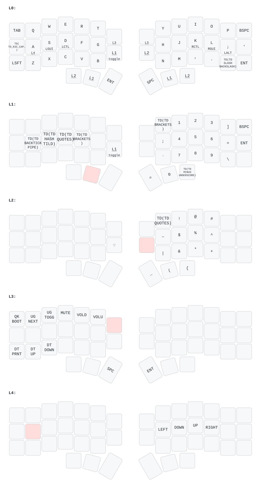

e# Corne Keyboard (crkbd) - rev4.1 Standard - joebutler23 Keymap

This directory contains configuration files and documentation related to the `joebutler23` keymap for the Corne keyboard (crkbd), specifically for the `rev4.1/standard` variant.

## Keymap Source

The primary source file for this keymap is located within your QMK Firmware directory:
`~/qmk_firmware/keyboards/crkbd/keymaps/joebutler23/keymap.c`

Configuration and build options are handled by the `crkbd/rev4_1/standard` target.

## Compilation

To compile this keymap, navigate to your QMK Firmware directory (`~/qmk_firmware`) in the terminal and run the following command:

```bash
cd ~/qmk_firmware
make clean
qmk compile -kb crkbd/rev4_1/standard -km joebutler23
```

This command specifies the keyboard (`crkbd/rev4_1/standard`) and your keymap folder (`joebutler23`) to build the firmware.


## Flashing

After successfully compiling the firmware, you can flash it to your keyboard.

1.  Put your Corne keyboard into bootloader mode using the key on layer 3
2.  Once the keyboard is in bootloader mode, run the following command from your QMK Firmware directory (`~/qmk_firmware`):

```bash
qmk flash -kb crkbd/rev4_1/standard -km joebutler23
```

Normally you have to manually mount the folder in Thunar and then the command will detect the keyboard in bootloader mode and upload the compiled firmware.

## Layout Visualization

To generate a visual representation of your keymap, you can use the `keymap-drawer` tool.

1.  **Install `keymap-drawer`:** Install using pipx (recommended):
    ```bash
    pipx install keymap-drawer
    ```
    
    Alternatively, follow the installation instructions in the [keymap-drawer repository](https://github.com/caksoylar/keymap-drawer).

2.  **Run the update script:** After making changes to your keymap, run the provided script to automatically update the visualization:

    ```bash
    cd /home/joebutler/.dotfiles/config/keyboard
    ./update_keymap_visualization.sh
    ```

    This script will:
    - Compile your keymap
    - Generate a YAML representation
    - Create an SVG visualization
    - Convert it to PNG
    - Save both files to your dotfiles directory

3.  **Manual process (if needed):** If you prefer to run the commands manually:

    ```bash
    # Generate YAML from keymap.c
    qmk c2json /home/joebutler/qmk_firmware/keyboards/crkbd/keymaps/joebutler23/keymap.c | keymap parse -c 10 -q - > crkbd_joebutler23.yaml
    
    # Create SVG from YAML
    keymap draw crkbd_joebutler23.yaml > crkbd_joebutler23.ortho.svg
    
    # Convert to PNG
    convert crkbd_joebutler23.ortho.svg crkbd_keymap.png
    ```

### Current Keymap Visualization



## Requesting Further Amendments

If you need to make further changes to this keymap or configuration in the future, you can provide context by mentioning this README file and the relevant keymap source files:

- `/home/joebutler/qmk_firmware/keyboards/crkbd/keymaps/joebutler23/keymap.c` (for key assignments and layers)
- `/home/joebutler/qmk_firmware/keyboards/crkbd/keymaps/joebutler23/config.c` (config file)
- `/home/joebutler/qmk_firmware/keyboards/crkbd/keymaps/joebutler23/config.h` (keymap specific C header)
- `/home/joebutler/qmk_firmware/keyboards/crkbd/rules.mk` (keyboard build options)

Note, any amends should be reflected in updated keymaps in this file.

## Implementing Changes

After making changes to the YAML configuration files in this directory, you need to update the actual QMK keymap source file to implement the changes:

1. **Update the QMK keymap.c file:**
   ```bash
   # Navigate to your QMK keymap directory
   cd ~/qmk_firmware/keyboards/crkbd/keymaps/joebutler23
   
   # Edit the keymap.c file to match the changes in the YAML files
   # The YAML files in this directory serve as the reference for what changes need to be made
   ```

2. **Compile and test:**
   ```bash
   # Compile the updated keymap
   qmk compile -kb crkbd/rev4_1/standard -km joebutler23
   
   # Flash to your keyboard (put keyboard in bootloader mode first)
   qmk flash -kb crkbd/rev4_1/standard -km joebutler23
   ```

3. **Update visualizations:**
   ```bash
   # Run the visualization update script
   cd /home/joebutler/.dotfiles/config/keyboard
   ./update_keymap_visualization.sh
   ```

## Changelog

### 2025-10-07
- **Layer 2 Modifications:**
  - Changed right thumb key from `(` to `+` for easier access to plus symbol
- **Home Row Mod Changes:**
  - Changed semicolon key from right alt (`RALT`) to left alt (`LALT`) on layer 0
- **Caps Word Configuration:**
  - Removed caps word activation from F+J mod-tap keys
  - Added double-tap ESC functionality: `DT(ESC, CAPS_WORD)` - double tap ESC to activate caps word
- **Visualization Updates:**
  - Updated keymap visualizations (SVG and PNG) to reflect all changes
  - Added pipx installation requirement for keymap-drawer tool
- **Files Modified:**
  - `crkbd_joebutler23.yaml`: Updated layer 2, semicolon mod, and ESC key configurations
  - `keymap.yaml`: Updated corresponding configurations
  - `crkbd_keymap.svg` and `crkbd_keymap.png`: Updated visualizations
  - `README.md`: Added pipx installation instructions

### 2025-01-09
- **Layer 4 Navigation Enhancements:**
  - Added Page Up functionality to U key position (`KC_PGUP`)
  - Added Page Down functionality to I key position (`KC_PGDN`)
  - Layer 4 now provides comprehensive navigation: arrow keys (home row) and page navigation (U/I positions)
  - Access layer 4 via LT(4,A) key (A key on base layer)
- **Files Modified:**
  - `keymap.c`: Updated layer 4 keymap array to include `KC_PGUP` and `KC_PGDN`
  - `keymap.yaml`: Updated layer 4 configuration to reflect new page navigation keys

### 2025-06-25
- **Layer 1 Modifications:**
  - Removed `LAlt`, `LGui`, `LCtl`, and `LSft` from Layer 1.
  - **New Tap Dance Keys Added to Layer 1:**
    - `TD(Backtick)`: 1 tap = `` ` ``, 2 taps = `|` (replaces `LAlt`)
    - `TD(Hash)`: 1 tap = `#`, 2 taps = `~` (replaces `LGui`)
    - `TD(Quotes)`: Moved to replace `LCtl`
    - `TD(Brackets)`: Moved to replace `LSft`
- **Tapping Terms Simplified:**
  - Updated base tapping term from 200ms to 250ms for all keys
  - Removed per-key tapping terms (`TAPPING_TERM_PER_KEY`) - now relies on Chordal Hold for same-hand vs cross-hand behaviour
  - Removed `get_tapping_term()` function from keymap.c
- **Flow Tap Added:**
  - Enabled Flow Tap with 150ms timeout (`FLOW_TAP_TERM 150`)
  - Disables hold behaviour during fast typing sequences to prevent accidental modifier activation
  - Complements Chordal Hold for improved home row mod experience
- **Tap Dance Features Added:**
  - Enabled tap dance functionality (`TAP_DANCE_ENABLE = yes`)
  - **Layer 1 Brackets Key:** Smart bracket pairs with cursor positioning
    - 1 tap = `()` with cursor between parentheses
    - 2 taps = `[]` with cursor between square brackets  
    - 3 taps = `{}` with cursor between curly braces
  - **Layer 2 Quotes Key:** Smart quote pairs with cursor positioning
    - 1 tap = `''` with cursor between single quotes
    - 2 taps = `""` with cursor between double quotes (fixed UK keyboard layout issue)
  - **Layer 1 Backtick/Pipe Key:** Enhanced for R Markdown workflows
    - 1 tap = `` ` `` (backtick)
    - 2 taps = `|` (pipe)
    - 3 taps = ``` ``` ``` (triple backticks for code blocks)
  - **Layer 1 Minus/Underscore Key:** Programming convenience
    - 1 tap = `-` (minus/hyphen)
    - 2 taps = `_` (underscore)
  - **Base Layer Slash/Backslash Key:** Path and escape character convenience
    - 1 tap = `/` (forward slash)
    - 2 taps = `\` (backslash)
- **UK Keyboard Layout Support:**
  - Added `#include "sendstring_uk.h"` to properly handle UK keyboard layout for `SEND_STRING` operations
  - This ensures all special characters are correctly mapped for UK keyboards
- **Smart Bracket/Quote Features:**
  - Automatically places cursor between bracket/quote pairs for immediate typing
  - Temporarily disables modifiers during insertion to prevent conflicts
  - Restores modifier state after insertion
  - Fixed all UK/US layout issues by using `SEND_STRING` with literal characters for `"` (double quote), `#` (hash), `~` (tilde), `|` (pipe), and `\` (backslash)
- **Files Modified:**
  - `config.h`: Updated tapping term to 250ms, removed per-key configuration, added Flow Tap
  - `keymap.c`: Removed per-key tapping function, added smart bracket/quote tap dance implementations, fixed all UK/US layout issues using `SEND_STRING` for problematic characters, added new tap dance functions for hash/tilde, backtick/pipe, and slash/backslash, updated Layer 1 and Base Layer keymaps
  - `rules.mk`: Added tap dance enable
  - `keymap.yaml`: Updated Layer 1 and Base Layer to reflect new tap dance keys and positions
  - Layer 1: Replaced `KC_LBRC` with `TD(TD_BRACKETS)`
  - Layer 2: Replaced `KC_QUOT` with `TD(TD_QUOTES)`
  - Base Layer: Replaced `KC_SLSH` with `TD(TD_SLASH_BACKSLASH)`

### 2025-01-07
- **Tapping Terms Updated:**
  - Increased base tapping term from 175ms to 200ms
  - Implemented per-key tapping terms: mod-tap keys now use 400ms to prevent same-hand conflicts
  - Added `TAPPING_TERM_PER_KEY` configuration
- **Caps Word Feature Added:**
  - Enabled caps word functionality (`CAPS_WORD_ENABLE = yes`)
  - Configured activation via both shift keys pressed simultaneously (`BOTH_SHIFTS_TURNS_ON_CAPS_WORD`)
  - Activate by holding both F (left shift) and J (right shift) mod-tap keys
- **Files Modified:**
  - `config.h`: Added tapping term and caps word configurations
  - `keymap.c`: Added `get_tapping_term()` function for per-key timing
  - `rules.mk`: Created to enable caps word feature

### 2025-01-07
- **Tapping Terms Updated:**
  - Increased base tapping term from 175ms to 200ms
  - Implemented per-key tapping terms: mod-tap keys now use 400ms to prevent same-hand conflicts
  - Added `TAPPING_TERM_PER_KEY` configuration
- **Caps Word Feature Added:**
  - Enabled caps word functionality (`CAPS_WORD_ENABLE = yes`)
  - Configured activation via both shift keys pressed simultaneously (`BOTH_SHIFTS_TURNS_ON_CAPS_WORD`)
  - Activate by holding both F (left shift) and J (right shift) mod-tap keys
- **Files Modified:**
  - `config.h`: Added tapping term and caps word configurations
  - `keymap.c`: Added `get_tapping_term()` function for per-key timing
  - `rules.mk`: Created to enable caps word feature
